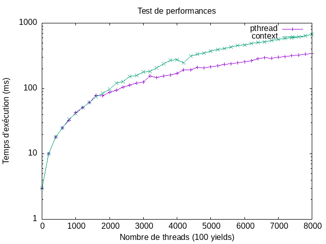

# User Space Threading Library

User space threading library project using `ucontext`.



## Build

Use `make config=release` to build the two libraries in `build`:

- `liboscontext.so`
- `libospthread.so`

## Tests

1. Compile all the tests with `make config=release compiletests`.
2. Add `build` to the shared library search path:

   ```
   $ export LD_LIBRARY_PATH="$LD_LIBRARY_PATH:$(pwd)/build"
   ```

3. Run a test from `tests/build`.

## Benches

1. Install `gnuplot`.
2. Run `make config=release bench`.

The graphs are written to `benchs/pngfiles`.
